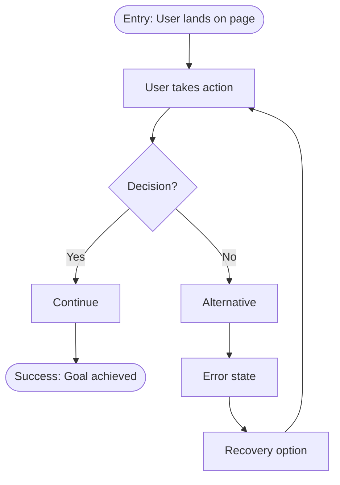

# User Flow Schema

User journey diagrams in Mermaid format.

## CRITICAL: 15 Node Maximum

* **The diagram MUST have 15 or fewer total nodes.**
* Count every shape as one node: `A[action]` = 1, `B{decision}` = 1, `C([entry])` = 1

## If Flow Needs More Than 15 Nodes

1. **Split into multiple diagrams** - e.g., "Login Flow" + "Registration Flow" + "Password Reset Flow"
2. **Abstract sub-flows** - Replace detailed steps with `[See Sub-flow X]`
3. **Focus on primary path** - Detail the happy path, simplify alternatives

## Required Elements

* **Entry point**: Exactly one
* **Exit points**: At least one success state
* **Decisions**: All paths labeled (Yes/No, Option A/B)
* **Error states**: Must have recovery path if present

## Validation Rules

* Exactly one entry point
* At least one exit point with success state
* All decision nodes have labeled paths
* Error states have recovery paths
* **MAX 15 nodes total** - split if more needed
* Labels describe user actions, not technical operations

## Node Types

* Start: `A([Entry: ...])` - Single entry point
* Action: `B[User does X]` - User takes action
* Decision: `C{Question?}` - Branch point
* Success: `D([Success: ...])` - Happy path end
* Error: `E[Error: ...]` - Failure state
* Sub-flow: `F[See: Flow Name]` - Reference another diagram

## Mermaid Syntax

## Common Mistakes to Avoid

* `POST /api/users` → `User submits form` (Labels describe user actions)
* 20+ node diagram → Split into sub-flows (Max 15 nodes)
* No error handling → Include error + recovery (Real flows have failures)
* Multiple entry points → Single entry (One journey per diagram)
