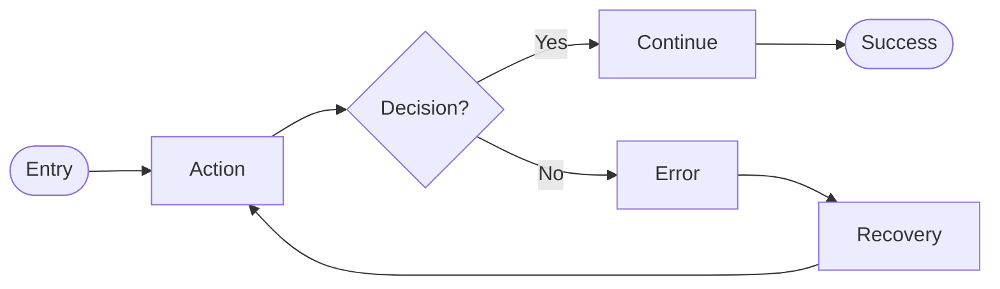

# Journey

Create user journey diagrams, update PRD with link.

Use the **user-flow-schema** rule for output format and validation.

## Step 1: Gather Context

1. IF Notion PRD URL provided, fetch the PRD
2. IF feature name provided, search Notion for existing PRD
3. Extract user stories and acceptance criteria if available

## Step 2: Confirm Flow Details

**RULE: If ANY requirement is unclear, ask questions.**

Ask about:
1. **Entry point** - "Where does the user start?"
2. **Primary goal** - "What is the user trying to accomplish?"
3. **Key decisions** - "What choices will the user make?"
4. **Error scenarios** - "What can go wrong? How to handle?"
5. **Exit points** - "Where can the user complete or leave?"

## Step 3: Create User Flow

**CRITICAL: Max 15 nodes total. Split complex flows.**

Create visual flow using Mermaid syntax:

For complex flows, split into:
* Main flow (15 nodes max)
* Sub-flows referenced by name

## Step 4: Update PRD (if exists)

If PRD exists from Step 1:
1. Fetch the PRD page
2. Add flow reference with diagram
3. Include the Mermaid source code

## Report

* Flow created: Yes
* PRD updated: Yes/No (with URL)
* Node count: X nodes, Y decisions, Z error paths
* Next: `/prototype` or `/epic`
