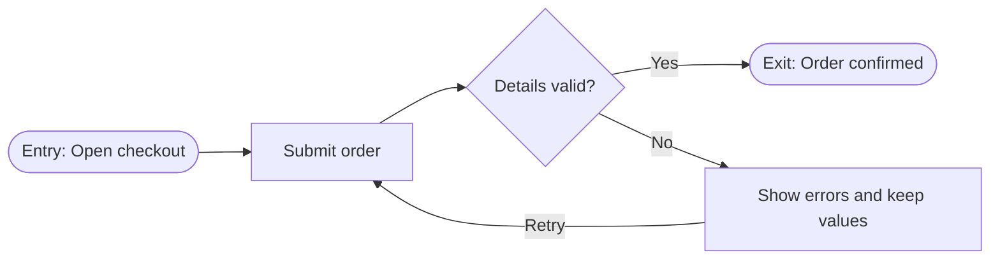

<!-- GENERATED from skills/journey/SKILL.md — edit the canonical file, then run: python3 -m vorbit_core.project_skills --write -->

# Journey Skill

Create user journey diagrams in FigJam using Mermaid syntax.

Read and follow `../references/execution-contract.md` before starting.

## Step 1: Load Diagram Prerequisite and Verify Tools

Preflight required connectors: confirm each needed connector is configured in Codex and inspect its current operation/parameter schemas; never guess tool names before using an external tool.

Before every `generate_diagram` call, load the installed Figma prerequisite whose unqualified skill name is `figma-generate-diagram` (use its catalog-qualified name when the host prefixes plugin skills). Read the flowchart reference it routes to and treat its current Mermaid constraints, density guidance, and tool parameters as authoritative. Do not call the tool first or rely on stale copied limits.

If the prerequisite or Figma connection is unavailable, draft and validate the complete text flow, then report diagram creation as `blocked_missing_capability`; do not lose the work.

## Step 2: Gather PRD Context

Linear is the canonical PRD provider. Resolve context in this order:

1. Linear PRD URL or ID -> use `get_issue`.
2. Feature name -> use `list_issues` with a scoped title search, ask if multiple candidates match, then use `get_issue`.
3. Explicit pasted PRD text or user-specified local file -> use it as a legacy fallback and record the provenance.
4. Non-Linear URL with no accessible content -> ask the user to paste/export it; do not guess.

Extract and preserve:

- User stories (`US-###`)
- Story-scoped acceptance criteria (the checkbox items under each `US-###` heading) — quote them verbatim; they have no IDs
- Flow steps (the numbered list under each `### Flow N:` heading), including Entry/Exit markers, branches, retries, and loops — address them as `Flow N, step M`
- Constraints and implementation-affecting `TBD-###` items

For a legacy PRD without stable IDs, assign draft `US-###` IDs and number its flows and steps without changing meaning. Show the normalization to the user before updating any source.

## Step 3: Confirm Flow Details

**RULE: If ANY requirement is unclear, use plain-text chat questions.**

Ask about:
1. **Entry point** - "Where does the user start?"
2. **Primary goal** - "What is the user trying to accomplish?"
3. **Key decisions** - "What choices will the user make?"
4. **Error scenarios** - "What can go wrong? How to handle?"
5. **Exit points** - "Where can the user complete or leave?"

Do not ask again when the PRD already answers the question. If an answer changes a canonical requirement, flag the conflict and get explicit confirmation before changing the flow or PRD.

## Step 4: Draft Flow in Chat

Show the complete flow and coverage ledger for review:

```
User Flow: [Feature Name]

Flow 1: [Flow name from the PRD]
1. [Entry] User lands on...
   ↓
2. [Action] User clicks...
   ↓
3. [Decision] Is valid?
   → Yes: step 4
   → No: step 5
4. [Action] System processes... → step 6
5. [Recovery] Show error and preserve values → Retry: step 2
6. [Exit] User sees confirmation

Coverage:
- "User can submit the form from the entry screen" → Flow 1, step 1; Flow 1, step 2
- "Invalid input shows an error and preserves entered values" → Flow 1, step 3; Flow 1, step 5
```

**After showing draft, ask:** "Does this flow look correct? Ready to create in FigJam?"

Before asking, verify:

- Every source flow step appears in the outline exactly once as a defined step
- Every source acceptance criterion maps to at least one step
- Every branch reaches an exit or an explicit loop/continuation
- No retry, alternate path, or requirement was removed to simplify the picture

## Step 5: Create User Flow in FigJam

**Only proceed after user confirms the draft.**

Use `generate_diagram` with the parameters and syntax required by the prerequisite loaded in Step 1. Label every node with the user-facing action from its flow step, for example `Submit order`, and keep node order matching the PRD flow so each node is addressable as `Flow N, step M` in the coverage ledger.

### Split Complex Flows Without Dropping Behavior

Use the current prerequisite's density guidance. When the complete journey is too dense:

1. Split at cohesive sub-flow boundaries, not by deleting alternate/error paths.
2. Generate a small overview plus every required detail diagram.
3. Add explicit continuation nodes such as `Continue: Flow 2, step 1` and `Return: Flow 1, step 2` so cross-diagram loops remain traceable.
4. Preserve real retry/re-entry loops. A loop is not an error in the model; simplify its routing only if the prerequisite says the rendered graph is unreadable.
5. Reuse the first returned FigJam `fileKey` for related diagrams so the set stays in one file.
6. Keep a coverage ledger: acceptance criterion (quoted, abbreviated if long) -> `Flow N, step M` -> diagram name/node. Generation is incomplete until every acceptance criterion and flow step is represented.

Illustrative flowchart only; the loaded prerequisite wins if syntax guidance changes:



## Step 6: Update PRD

If the canonical Linear PRD exists, use `get_issue` to re-read its latest description, then the connector's issue-update operation to add or replace a `## Journey Diagrams` section containing:

- Every FigJam URL and diagram name
- The covered flow-step range
- The Mermaid source as a recovery artifact
- The coverage ledger

Preserve every existing PRD section and requirement. Do not overwrite concurrent edits. For legacy fallback input, report the URLs in chat and offer the updated section for import; do not claim a local/pasted source was updated.

After each `generate_diagram` call, expose the returned URL as a markdown link. For a split journey, return every diagram URL, not only the overview.

## Step 7: Report

- FigJam flow created: Yes (all URLs)
- PRD source: Linear canonical ticket or named legacy fallback
- PRD updated: Yes/No (with URL when canonical)
- Coverage: X/X acceptance criteria and Y/Y flow steps
- Split summary: diagram name -> covered flow steps (e.g. `Flow 1, steps 1-6`)
- Next: `$vorbit-prototype` or `$vorbit-epic`

---

# Journey Schema & Validation

## FigJam Integration

Load `figma-generate-diagram`, then use its current `generate_diagram` tool:
- Input: Mermaid syntax + name + userIntent
- Output: Shareable FigJam URL
- Diagram type for this workflow: flowchart (as routed by the prerequisite for user journeys)

## Required Elements

| Element | Required | Rules |
|---------|----------|-------|
| Entry point | Yes | At least one explicit entry for the journey or sub-flow |
| Exit points | Yes | At least one success state |
| Decisions | When present in requirements | Every real branch is represented and all paths are labeled; never invent a branch to satisfy the template |
| Error states | No | Must terminate or have an explicit recovery/loop path |
| Requirement coverage | Yes | Every acceptance criterion and flow step appears in the coverage ledger |

## Node Types

| Type | Syntax | Use For |
|------|--------|---------|
| Start | `A(["Entry: ..."])` | Entry point |
| Action | `B["User does X"]` | User takes action |
| Condition | `C["Filter setting"]` | Settings/filter nodes |
| Decision | `D{"Question?"}` | Branch point |
| Success | `E(["Exit: Success"])` | Happy path end |
| Error | `F["Error shown"]` | Failure state |
| Sub-flow | `G["Continue: Flow 2, step 1"]` | Reference another diagram without losing traceability |

## Validation Rules

- Every diagram has an explicit entry/continuation point
- At least one exit point with success state
- All decision nodes have labeled paths (`-->|"Yes"|`, `-->|"No"|`)
- Real retries and re-entry loops remain explicit
- Complex flows are split according to current prerequisite guidance, with overview/detail continuity
- Every source flow step and acceptance criterion appears in the coverage ledger
- Labels describe user actions, not technical operations
- Mermaid passes the prerequisite's pre-call validation

## Template

```markdown
# User Flow: [FEATURE_NAME]

## Overview
[One sentence describing the journey]

## Flow Diagram

Name: [Feature] User Flow
Mermaid:
flowchart LR
    entry(["Entry: User opens feature"]) --> action["First action"]
    action --> condition{"Condition?"}
    condition -->|"Yes"| success(["Exit: Goal achieved"])
    condition -->|"No"| error["Show invalid input"]
    error -->|"Retry"| action

Coverage:
- "[Acceptance criterion text, abbreviated if long]" -> Flow 1, step 1; Flow 1, step 2 -> [Feature] User Flow
- "[Acceptance criterion text, abbreviated if long]" -> Flow 1, step 3; Flow 1, step 5 -> [Feature] User Flow

## FigJam URL
[Generated URL from tool]
```

## Common Mistakes

| Wrong | Right | Why |
|-------|-------|-----|
| Delete retry/alternate branches to reduce density | Split into overview + complete detail flows | Readability cannot erase requirements |
| `POST /api/users` | `["User submits form"]` | Labels describe user actions |
| Ship a diagram with no coverage ledger | Map every acceptance criterion to the `Flow N, step M` nodes that satisfy it | Diagram stays traceable to the PRD |
| Regenerate each split into a new file | Reuse the returned `fileKey` | Related diagrams stay together |
| Copy old Mermaid limits here | Load `figma-generate-diagram` before every call | Current prerequisite stays authoritative |
