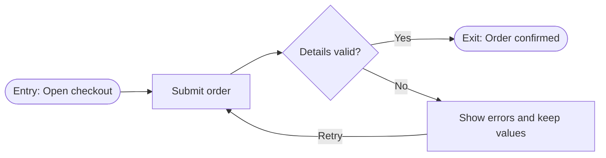

<!-- GENERATED from skills/journey/SKILL.md — edit the canonical file, then run: python3 -m vorbit_core.project_skills --write -->

# Journey Skill

Create user journey diagrams in FigJam using Mermaid syntax.

Read and follow `../references/execution-contract.md` before starting.

## Step 1: Load Diagram Prerequisite and Verify Tools

Preflight required connectors: confirm each needed connector is configured in Codex and inspect its current operation/parameter schemas; never guess tool names before using an external tool.

Before every `generate_diagram` call, load the installed Figma prerequisite whose unqualified skill name is `figma-generate-diagram` (use its catalog-qualified name when the host prefixes plugin skills). Read the flowchart reference it routes to and treat its current Mermaid constraints, density guidance, and tool parameters as authoritative. Do not call the tool first or rely on stale copied limits.

If the prerequisite or Figma connection is unavailable, draft and validate the complete text flow, then report diagram creation as `blocked_missing_capability`; do not lose the work.

## Step 2: Gather PRD Context

The branch `prd.md` is the canonical PRD. Resolve it per `../references/spec-files.md`. When no `prd.md` exists:

1. Linear ticket URL or ID, pasted PRD text, or a user-named local file -> use it as a legacy import and record the provenance.
2. URL with no accessible content -> ask the user to paste/export it; do not guess.

Extract and preserve:

- User stories (`US-###`)
- Story-scoped acceptance criteria (the checkbox items under each `US-###` heading) — quote them verbatim; they have no IDs
- Flow steps (the numbered `**User Flow:**` list inside each `US-###` story), including Entry/Exit markers, branches, retries, and loops — address them as `US-###, flow step M`
- Constraints and implementation-affecting `TBD-###` items

For a legacy PRD without stable IDs, assign draft `US-###` IDs and number its flows and steps without changing meaning. Show the normalization to the user before updating any source.

## Step 3: Confirm Flow Details

**RULE: If ANY requirement is unclear, use plain-text chat questions.**

Ask about: entry point, primary goal, key decisions, error scenarios, exit points.

Do not ask again when the PRD already answers the question. If an answer changes a canonical requirement, flag the conflict and get explicit confirmation before changing the flow or PRD.

## Step 4: Draft Flow in Chat

Show the complete flow and coverage ledger for review:

```
User Flow: [Feature Name]

US-001: [Story title from the PRD]
1. [Entry] User lands on...
   ↓
2. [Action] User clicks...
   ↓
3. [Decision] Is valid?
   → Yes: step 4
   → No: step 5
4. [Action] System processes... → step 6
5. [Recovery] Show error and preserve values → Retry: step 2
6. [Exit] User sees confirmation

Coverage:
- "User can submit the form from the entry screen" → US-001, flow step 1; US-001, flow step 2
- "Invalid input shows an error and preserves entered values" → US-001, flow step 3; US-001, flow step 5
```

**After showing draft, ask:** "Does this flow look correct? Ready to create in FigJam?"

Before asking, verify:

- Every source flow step appears in the outline exactly once as a defined step
- Every source acceptance criterion maps to at least one step
- Every branch reaches an exit or an explicit loop/continuation
- No retry, alternate path, or requirement was removed to simplify the picture

## Step 5: Create User Flow in FigJam

**Only proceed after user confirms the draft.**

Use `generate_diagram` with the parameters and syntax required by the prerequisite loaded in Step 1. Label every node with the user-facing action from its flow step, for example `Submit order`, and keep node order matching the PRD flow so each node is addressable as `US-###, flow step M` in the coverage ledger.

### Split Complex Flows Without Dropping Behavior

Use the current prerequisite's density guidance. When the complete journey is too dense:

1. Split at cohesive sub-flow boundaries, not by deleting alternate/error paths.
2. Generate a small overview plus every required detail diagram.
3. Add explicit continuation nodes such as `Continue: US-002, flow step 1` and `Return: US-001, flow step 2` so cross-diagram loops remain traceable.
4. Preserve real retry/re-entry loops. A loop is not an error in the model; simplify its routing only if the prerequisite says the rendered graph is unreadable.
5. Reuse the first returned FigJam `fileKey` for related diagrams so the set stays in one file.
6. Keep a coverage ledger: acceptance criterion (quoted, abbreviated if long) -> `US-###, flow step M` -> diagram name/node. Generation is incomplete until every acceptance criterion and flow step is represented.

Illustrative flowchart only; the loaded prerequisite wins if syntax guidance changes:


```mermaid
flowchart LR
    entry(["Entry: Open checkout"]) --> submit["Submit order"]
    submit --> valid{"Details valid?"}
    valid -->|"Yes"| success(["Exit: Order confirmed"])
    valid -->|"No"| error["Show errors and keep values"]
    error -->|"Retry"| submit
```

## Step 6: Hand Off the Diagrams

Report in chat:

- Every FigJam URL and diagram name
- The covered flow-step range
- The Mermaid source as a recovery artifact
- The coverage ledger

Do not edit `prd.md` (the prd skill owns it) or Linear (the ticket skill owns it).

After each `generate_diagram` call, expose the returned URL as a markdown link. For a split journey, return every diagram URL, not only the overview.

## Step 7: Report

- FigJam flow created: Yes (all URLs)
- PRD source: branch `prd.md` or named legacy fallback
- Coverage: X/X acceptance criteria and Y/Y flow steps
- Split summary: diagram name -> covered flow steps (e.g. `US-001, flow steps 1-6`)
- Next: `$vorbit-prototype` or `$vorbit-epic`

---

# Journey Schema & Validation

## FigJam Integration

Load `figma-generate-diagram`, then use its current `generate_diagram` tool:
- Input: Mermaid syntax + name + userIntent
- Output: Shareable FigJam URL
- Diagram type for this workflow: flowchart (as routed by the prerequisite for user journeys)

## Required Elements

| Element | Required | Rules |
|---------|----------|-------|
| Entry point | Yes | At least one explicit entry for the journey or sub-flow |
| Exit points | Yes | At least one success state |
| Decisions | When present in requirements | Every real branch is represented and all paths are labeled; never invent a branch to satisfy the template |
| Error states | No | Must terminate or have an explicit recovery/loop path |
| Requirement coverage | Yes | Every acceptance criterion and flow step appears in the coverage ledger |

## Template

```markdown
# User Flow: [FEATURE_NAME]

## Overview
[One sentence describing the journey]

## Flow Diagram

Name: [Feature] User Flow
Mermaid: [flowchart source — syntax per the loaded prerequisite; see the Step 5 example]

Coverage:
- "[Acceptance criterion text, abbreviated if long]" -> US-001, flow step 1; US-001, flow step 2 -> [Feature] User Flow
- "[Acceptance criterion text, abbreviated if long]" -> US-001, flow step 3; US-001, flow step 5 -> [Feature] User Flow

## FigJam URL
[Generated URL from tool]
```

## Common Mistakes

| Wrong | Right | Why |
|-------|-------|-----|
| Delete retry/alternate branches to reduce density | Split into overview + complete detail flows | Readability cannot erase requirements |
| `POST /api/users` | `["User submits form"]` | Labels describe user actions |
| Ship a diagram with no coverage ledger | Map every acceptance criterion to the `US-###, flow step M` nodes that satisfy it | Diagram stays traceable to the PRD |
| Regenerate each split into a new file | Reuse the returned `fileKey` | Related diagrams stay together |
| Copy old Mermaid limits here | Load `figma-generate-diagram` before every call | Current prerequisite stays authoritative |
