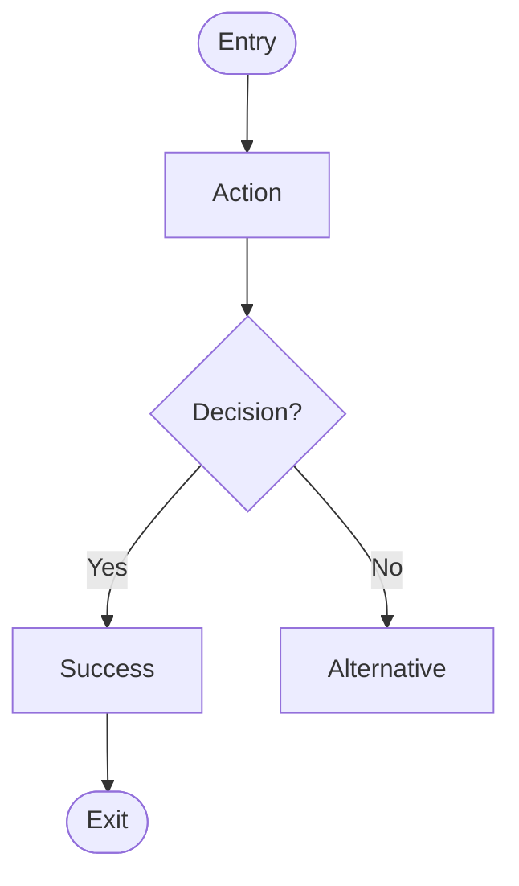

Create a user flow for: $ARGUMENTS

## Step 1: Gather Context

1. IF Notion PRD URL provided, fetch and read the PRD
2. IF feature name provided, search Notion for existing PRD
3. Extract user stories and acceptance criteria if available

## Step 2: Confirm Flow Details via Conversation

**RULE: If ANY requirement is unclear, MUST use AskUserQuestion tool.**

Use **AskUserQuestion** tool to confirm key flow elements:

1. **Entry point** - "Where does the user start this journey?"
   - From dashboard, landing page, notification, etc.

2. **Primary goal** - "What is the user trying to accomplish?"
   - The happy path success state

3. **Key decisions** - "What choices will the user need to make?"
   - Branch points in the flow

4. **Error scenarios** - "What can go wrong? How should we handle it?"
   - Validation errors, permission denied, timeout, etc.

5. **Exit points** - "Where can the user leave or complete the flow?"
   - Success, cancel, abandon, redirect

Keep questions conversational. Confirm understanding before generating.

## Step 3: Create User Flow

Use the **user-flow-schema** skill for exact output format.

Generate flow with confirmed details:
- **Entry point**: Where user starts (one only)
- **Actions**: What user does (keep under 15 steps)
- **Decisions**: Where user chooses (label all paths)
- **Success states**: Happy path endings
- **Error states**: What can go wrong (include recovery)
- **Exit points**: Where user leaves

## Step 4: Generate Mermaid

Create Mermaid flowchart:

Rules:
- Use `([text])` for entry/exit
- Use `[text]` for actions
- Use `{text?}` for decisions
- Label ALL decision paths with `-->|label|`
- Include error recovery paths

## Step 5: Update PRD

If PRD exists (from Step 1):
1. Fetch the PRD page
2. Update the **User Flow** section with the Mermaid diagram
3. Replace `[To be added via /vorbit:design:journey]` with the actual flow

## Step 6: Save Flow to Notion (Optional)

Ask user: "Save flow as separate document? (Notion database, page URL, or 'skip')"

If user wants separate document:
1. Use `notion-search` or `notion-fetch` to find target
2. Create flow document with Mermaid diagram
3. Link back to PRD

## Report

- PRD updated: Yes/No (with URL if updated)
- Flow document URL (if saved separately)
- Summary: X steps, Y decisions, Z error paths
- Next: `/vorbit:design:prototype` or `/vorbit:implement:epic`
