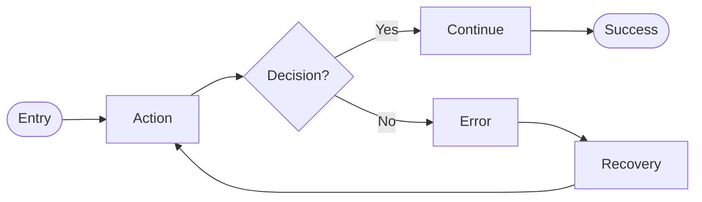

Create a user flow for: $ARGUMENTS

Use the **user-flow** skill for output format and validation rules.

## Step 1: Gather Context

1. IF Notion PRD URL provided, fetch the PRD
2. IF feature name provided, search Notion for existing PRD
3. Extract user stories and acceptance criteria if available

## Step 2: Confirm Flow Details

**RULE: If ANY requirement is unclear, use AskUserQuestion.**

Ask about:
1. **Entry point** - "Where does the user start?"
2. **Primary goal** - "What is the user trying to accomplish?"
3. **Key decisions** - "What choices will the user make?"
4. **Error scenarios** - "What can go wrong? How to handle?"
5. **Exit points** - "Where can the user complete or leave?"

## Step 3: Create User Flow in FigJam

**CRITICAL: Max 15 nodes total. Split complex flows.**

Use `mcp__plugin_figma_figma__generate_diagram` with:
- `name`: Descriptive title (e.g., "User Login Flow")
- `mermaidSyntax`: Flowchart using LR direction, all text in quotes
- `userIntent`: Brief description of what user is accomplishing

### Mermaid Syntax Rules for FigJam

**IMPORTANT**:
- Use `LR` direction (left-to-right)
- Put ALL text in quotes (`["text"]`, `{"text?"}`, `-->|"label"|`)
- No emojis in Mermaid code
- No `\n` for newlines

## Step 4: Update PRD in Notion

If PRD exists from Step 1:
1. Fetch the PRD page
2. Add FigJam URL under "User Flow" section
3. Include the Mermaid source code as backup

**IMPORTANT**: After calling generate_diagram, show the returned URL as a markdown link so user can view and edit.

## Report

- FigJam flow created: Yes (with URL)
- PRD updated: Yes/No (with URL)
- Node count: X nodes, Y decisions, Z error paths
- Next: `/vorbit:design:prototype` or `/vorbit:implement:epic`
