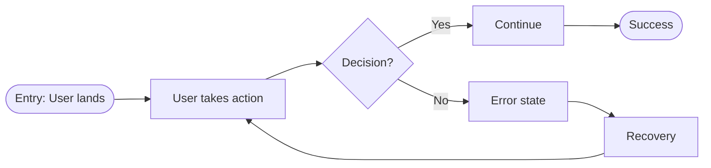

# User Flow Schema

User journey diagrams created in FigJam via Mermaid syntax.

## FigJam Integration

Use `mcp__plugin_figma_figma__generate_diagram` tool:
- Input: Mermaid syntax + name + userIntent
- Output: Shareable FigJam URL
- Supports: flowchart, sequenceDiagram, stateDiagram, gantt

## Required Elements

| Element | Required | Rules |
|---------|----------|-------|
| Entry point | Yes | Exactly one |
| Exit points | Yes | At least one success state |
| Decisions | Yes | All paths labeled |
| Error states | No | Must have recovery path if present |

## CRITICAL: 15 Node Maximum

**The diagram MUST have 15 or fewer total nodes.**

Count every shape as one node:
- `A["action"]` = 1 node
- `B{"decision"}` = 1 node
- `C(["entry"])` = 1 node

If your flow needs more than 15 nodes:
1. **Split into multiple diagrams** - e.g., "Login Flow" + "Registration Flow"
2. **Abstract sub-flows** - Replace detailed steps with `["See Sub-flow X"]`
3. **Focus on primary path** - Detail the happy path, simplify alternatives

## Mermaid Syntax for FigJam

**IMPORTANT**: FigJam requires all text in quotes.



## Node Types

| Type | Syntax | Use For |
|------|--------|---------|
| Start | `A(["Entry: ..."])` | Single entry point |
| Action | `B["User does X"]` | User takes action |
| Decision | `C{"Question?"}` | Branch point |
| Success | `D(["Success: ..."])` | Happy path end |
| Error | `E["Error: ..."]` | Failure state |
| Sub-flow | `F["See: Flow Name"]` | Reference another diagram |

## Validation Rules

- Exactly one entry point
- At least one exit point with success state
- All decision nodes have labeled paths (`-->|"Yes"|`, `-->|"No"|`)
- Error states have recovery paths
- **MAX 15 nodes total** - split if more needed
- Labels describe user actions, not technical operations
- **All text in quotes** for FigJam compatibility
- Use `LR` direction by default (left-to-right)

## Template

```markdown
# User Flow: [FEATURE_NAME]

## Overview
[One sentence describing the journey]

## Flow Diagram

Name: [Feature] User Flow
Mermaid:
flowchart LR
    START(["Entry: User opens feature"]) --> A["First action"]
    A --> B{"Condition?"}
    B -->|"Yes"| C["Second action"]
    B -->|"No"| D["Error: Invalid input"]
    D --> E["Show message"]
    E --> A
    C --> END(["Success: Goal achieved"])

Node count: 7/15

## FigJam URL
[Generated URL from tool]
```

## Common Mistakes

| Wrong | Right | Why |
|-------|-------|-----|
| `POST /api/users` | `["User submits form"]` | Labels describe user actions |
| 20+ node diagram | Split into sub-flows | Max 15 nodes per diagram |
| No quotes on text | `["Text in quotes"]` | FigJam requires quotes |
| `flowchart TD` | `flowchart LR` | LR is default for FigJam |
| No error handling | Include error + recovery | Real flows have failures |
