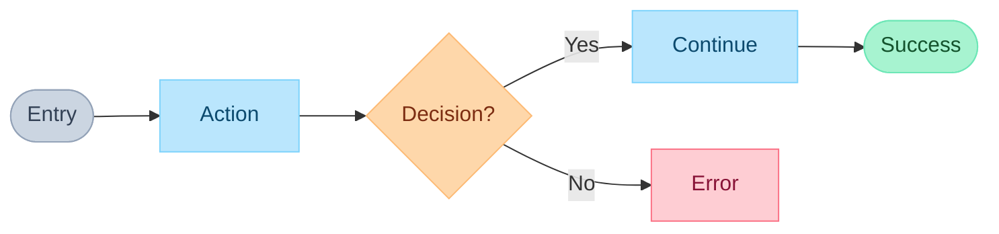

# Journey Skill

Create user journey diagrams in FigJam using Mermaid syntax.

## Step 1: Detect Platform & Verify Connection

Read and follow the platform detection steps in `_shared/platform-detection.md` (glob for `**/skills/_shared/platform-detection.md`). Pass the detected platform to subsequent steps.

## Step 2: Gather Context

1. IF Notion PRD URL provided, use `notion-find` to fetch the PRD
2. IF Anytype PRD URL or object ID provided, use `API-get-object` to fetch the PRD
3. IF feature name provided, search the detected platform for existing PRD
4. Extract user stories and acceptance criteria if available

## Step 3: Confirm Flow Details

**RULE: If ANY requirement is unclear, use AskUserQuestion.**

Ask about:
1. **Entry point** - "Where does the user start?"
2. **Primary goal** - "What is the user trying to accomplish?"
3. **Key decisions** - "What choices will the user make?"
4. **Error scenarios** - "What can go wrong? How to handle?"
5. **Exit points** - "Where can the user complete or leave?"

## Step 4: Draft Flow in Chat

**Show the flow as a text outline for review:**

```
User Flow: [Feature Name]

1. [Entry] User lands on...
   ↓
2. [Action] User clicks...
   ↓
3. [Decision] Is valid?
   → Yes: Continue to step 4
   → No: Show error → End
   ↓
4. [Action] System processes...
   ↓
5. [Success] User sees confirmation → End
```

**After showing draft, ask:** "Does this flow look correct? Ready to create in FigJam?"

## Step 5: Create User Flow in FigJam

**Only proceed after user confirms the draft.**

**CRITICAL: Max 15 nodes total. Split complex flows.**

Use `mcp__plugin_figma_figma__generate_diagram` with:
- `name`: Descriptive title (e.g., "User Login Flow")
- `mermaidSyntax`: Flowchart using LR direction, all text in quotes
- `userIntent`: Brief description of what user is accomplishing

### Mermaid Syntax Rules for FigJam



Note: Error state `E` is terminal. User sees the error and retries implicitly - no back-loop needed.

**IMPORTANT**:
- Use `LR` direction (left-to-right)
- Put ALL text in quotes (`["text"]`, `{"text?"}`, `-->|"label"|`)
- Apply color classes to ALL nodes using `:::className` syntax
- No emojis in Mermaid code
- No `\n` for newlines

## Step 6: Update PRD

If PRD exists from Step 2:

### If Notion PRD:
1. Use `notion-fetch` to get the PRD page
2. Add FigJam URL under "User Flow" section
3. Include the Mermaid source code as backup

### If Anytype PRD:
1. Use `API-get-object` to fetch the PRD
2. Use `API-update-object` to add FigJam URL under "User Flow" section
3. Include the Mermaid source code as backup

**IMPORTANT**: After calling generate_diagram, show the returned URL as a markdown link so user can view and edit.

## Step 7: Report

- FigJam flow created: Yes (with URL)
- PRD updated: Yes/No (with URL)
- Node count: X nodes, Y decisions, Z error paths
- Next: `/vorbit:design:prototype` or `/vorbit:implement:epic`

---

# Journey Schema & Validation

## FigJam Integration

Use `mcp__plugin_figma_figma__generate_diagram` tool:
- Input: Mermaid syntax + name + userIntent
- Output: Shareable FigJam URL
- Supports: flowchart, sequenceDiagram, stateDiagram, gantt

## Required Elements

| Element | Required | Rules |
|---------|----------|-------|
| Entry point | Yes | Exactly one |
| Exit points | Yes | At least one success state |
| Decisions | Yes | All paths labeled |
| Error states | No | Must have recovery path if present |

## CRITICAL: 15 Node Maximum

**The diagram MUST have 15 or fewer total nodes.**

Count every shape as one node:
- `A["action"]` = 1 node
- `B{"decision"}` = 1 node
- `C(["entry"])` = 1 node

If your flow needs more than 15 nodes:
1. **Split into multiple diagrams** - e.g., "Login Flow" + "Registration Flow"
2. **Abstract sub-flows** - Replace detailed steps with `["See Sub-flow X"]`
3. **Focus on primary path** - Detail the happy path, simplify alternatives

## Node Types

| Type | Syntax | Use For |
|------|--------|---------|
| Start | `A(["Entry: ..."]):::startend` | Single entry point |
| Action | `B["User does X"]:::action` | User takes action |
| Condition | `C["Filter setting"]:::condition` | Settings/filter nodes |
| Decision | `D{"Question?"}:::decision` | Branch point |
| Success | `E(["Success: ..."]):::positive` | Happy path end |
| Error | `F["Error: ..."]:::negative` | Failure state |
| Sub-flow | `G["See: Flow Name"]:::action` | Reference another diagram |

## Color Palette (Required)

Apply these styles to ALL diagrams:

| Node Type | Fill | Stroke | Use For |
|-----------|------|--------|---------|
| Start & End | `#CBD5E1` | `#94A3B8` | Entry/exit points |
| Action | `#BAE6FD` | `#7DD3FC` | User actions |
| Condition | `#C4B5FD` | `#A78BFA` | Filter/settings nodes |
| Decision | `#FED7AA` | `#FDBA74` | Branch points |
| Positive | `#A7F3D0` | `#6EE7B7` | Success states |
| Negative | `#FECDD3` | `#FB7185` | Error states |

## CRITICAL: No Back-Loops

**Back-loops break left-to-right layout.** Mermaid's layout algorithm (Dagre) cannot maintain LR direction when edges point backward.

❌ **Don't do this:**
```mermaid
A --> B --> C{"Valid?"}
C -->|"No"| D["Error"]
D --> B  // Back-loop breaks layout!
```

✅ **Do this instead:**
```mermaid
A --> B --> C{"Valid?"}
C -->|"No"| D["Error shown"]  // Terminal - user retries implicitly
C -->|"Yes"| E["Continue"]
```

**Error states should be terminal nodes.** The user's retry action is implicit.

## Validation Rules

- Exactly one entry point
- At least one exit point with success state
- All decision nodes have labeled paths (`-->|"Yes"|`, `-->|"No"|`)
- **No back-loops** - error states are terminal (implicit retry)
- **MAX 15 nodes total** - split if more needed
- Labels describe user actions, not technical operations
- **All text in quotes** for FigJam compatibility
- Use `LR` direction by default (left-to-right)

## Template

```markdown
# User Flow: [FEATURE_NAME]

## Overview
[One sentence describing the journey]

## Flow Diagram

Name: [Feature] User Flow
Mermaid:
flowchart LR
    START(["Entry: User opens feature"]):::startend --> A["First action"]:::action
    A --> B{"Condition?"}:::decision
    B -->|"Yes"| C["Second action"]:::action
    B -->|"No"| D["Error: Invalid input"]:::negative
    C --> END(["Success: Goal achieved"]):::startend

Node count: 5/15

## FigJam URL
[Generated URL from tool]
```

## Common Mistakes

| Wrong | Right | Why |
|-------|-------|-----|
| `Error --> Retry` (back-loop) | `Error` as terminal node | Back-loops break LR layout |
| `POST /api/users` | `["User submits form"]` | Labels describe user actions |
| 20+ node diagram | Split into sub-flows | Max 15 nodes per diagram |
| No quotes on text | `["Text in quotes"]` | FigJam requires quotes |
| `flowchart TD` | `flowchart LR` | LR is default for FigJam |
| No error states | Include error states | Real flows have failures |
