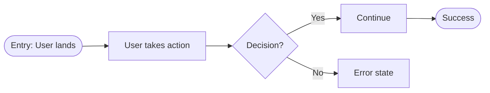

# User Flow Schema

User journey diagrams created in FigJam via Mermaid syntax.

## FigJam Integration

Use `mcp__plugin_figma_figma__generate_diagram` tool:
- Input: Mermaid syntax + name + userIntent
- Output: Shareable FigJam URL
- Supports: flowchart, sequenceDiagram, stateDiagram, gantt

## Required Elements

| Element | Required | Rules |
|---------|----------|-------|
| Entry point | Yes | Exactly one |
| Exit points | Yes | At least one success state |
| Decisions | Yes | All paths labeled |
| Error states | No | Must have recovery path if present |

## CRITICAL: 15 Node Maximum

**The diagram MUST have 15 or fewer total nodes.**

Count every shape as one node:
- `A["action"]` = 1 node
- `B{"decision"}` = 1 node
- `C(["entry"])` = 1 node

If your flow needs more than 15 nodes:
1. **Split into multiple diagrams** - e.g., "Login Flow" + "Registration Flow"
2. **Abstract sub-flows** - Replace detailed steps with `["See Sub-flow X"]`
3. **Focus on primary path** - Detail the happy path, simplify alternatives

## Mermaid Syntax for FigJam

**IMPORTANT**: FigJam requires all text in quotes. No back-loops.



## Node Types

| Type | Syntax | Use For |
|------|--------|---------|
| Start | `A(["Entry: ..."]):::startend` | Single entry point |
| Action | `B["User does X"]:::action` | User takes action |
| Condition | `C["Filter setting"]:::condition` | Settings/filter nodes |
| Decision | `D{"Question?"}:::decision` | Branch point |
| Success | `E(["Success: ..."]):::positive` | Happy path end |
| Error | `F["Error: ..."]:::negative` | Failure state |
| Sub-flow | `G["See: Flow Name"]:::action` | Reference another diagram |

## Color Palette (Required)

Apply these styles to ALL diagrams:

```mermaid
classDef startend fill:#CBD5E1,color:#334155,stroke:#94A3B8
classDef action fill:#BAE6FD,color:#0c4a6e,stroke:#7DD3FC
classDef condition fill:#C4B5FD,color:#4c1d95,stroke:#A78BFA
classDef decision fill:#FED7AA,color:#7c2d12,stroke:#FDBA74
classDef positive fill:#A7F3D0,color:#14532d,stroke:#6EE7B7
classDef negative fill:#FECDD3,color:#881337,stroke:#FB7185
```

| Node Type | Fill | Stroke | Use For |
|-----------|------|--------|---------|
| Start & End | `#CBD5E1` | `#94A3B8` | Entry/exit points |
| Action | `#BAE6FD` | `#7DD3FC` | User actions |
| Condition | `#C4B5FD` | `#A78BFA` | Filter/settings nodes |
| Decision | `#FED7AA` | `#FDBA74` | Branch points |
| Positive | `#A7F3D0` | `#6EE7B7` | Success states |
| Negative | `#FECDD3` | `#FB7185` | Error states |

## CRITICAL: No Back-Loops

**Back-loops break left-to-right layout.** Mermaid's layout algorithm (Dagre) cannot maintain LR direction when edges point backward.

❌ **Don't do this:**
```mermaid
A --> B --> C{"Valid?"}
C -->|"No"| D["Error"]
D --> B  // Back-loop breaks layout!
```

✅ **Do this instead:**
```mermaid
A --> B --> C{"Valid?"}
C -->|"No"| D["Error shown"]  // Terminal - user retries implicitly
C -->|"Yes"| E["Continue"]
```

**Error states should be terminal nodes.** The user's retry action is implicit - they see the error and correct their input. This keeps the diagram clean and strictly left-to-right.

## Validation Rules

- Exactly one entry point
- At least one exit point with success state
- All decision nodes have labeled paths (`-->|"Yes"|`, `-->|"No"|`)
- **No back-loops** - error states are terminal (implicit retry)
- **MAX 15 nodes total** - split if more needed
- Labels describe user actions, not technical operations
- **All text in quotes** for FigJam compatibility
- Use `LR` direction by default (left-to-right)

## Template

```markdown
# User Flow: [FEATURE_NAME]

## Overview
[One sentence describing the journey]

## Flow Diagram

Name: [Feature] User Flow
Mermaid:
flowchart LR
    START(["Entry: User opens feature"]):::startend --> A["First action"]:::action
    A --> B{"Condition?"}:::decision
    B -->|"Yes"| C["Second action"]:::action
    B -->|"No"| D["Error: Invalid input"]:::negative
    C --> END(["Success: Goal achieved"]):::startend

Node count: 5/15

## FigJam URL
[Generated URL from tool]
```

Note: Error state `D` is terminal. User sees the error and retries - no back-loop needed.

## Common Mistakes

| Wrong | Right | Why |
|-------|-------|-----|
| `Error --> Retry` (back-loop) | `Error` as terminal node | Back-loops break LR layout |
| `POST /api/users` | `["User submits form"]` | Labels describe user actions |
| 20+ node diagram | Split into sub-flows | Max 15 nodes per diagram |
| No quotes on text | `["Text in quotes"]` | FigJam requires quotes |
| `flowchart TD` | `flowchart LR` | LR is default for FigJam |
| No error states | Include error states | Real flows have failures |
