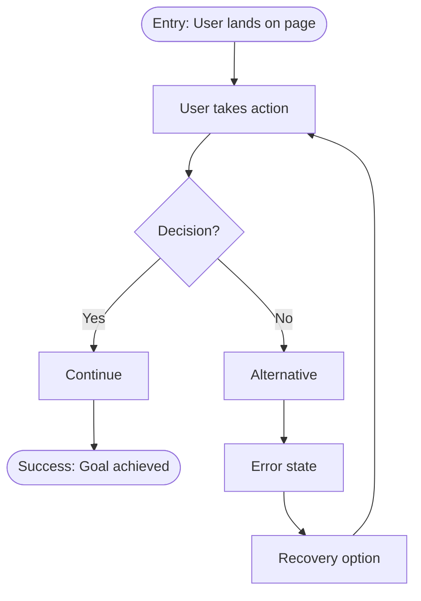

# User Flow Schema

User journey diagrams in Mermaid format for Notion.

## Required Elements

| Element | Required | Rules |
|---------|----------|-------|
| Entry point | Yes | Exactly one |
| Exit points | Yes | At least one success state |
| Decisions | Yes | All paths labeled |
| Error states | No | Must have recovery path if present |

## CRITICAL: 15 Node Maximum

**The diagram MUST have 15 or fewer total nodes.**

Count every shape as one node:
- `A[action]` = 1 node
- `B{decision}` = 1 node
- `C([entry])` = 1 node

If your flow needs more than 15 nodes:
1. **Split into multiple diagrams** - e.g., "Login Flow" + "Registration Flow" + "Password Reset Flow"
2. **Abstract sub-flows** - Replace detailed steps with `[See Sub-flow X]`
3. **Focus on primary path** - Detail the happy path, simplify alternatives

**Wrong (20+ nodes):**
```
A --> B --> C --> D --> E --> F --> G --> H
      |-> I --> J --> K
      |-> L --> M --> N --> O --> P
```

**Right (15 nodes, sub-flows referenced):**
```
A([Start]) --> B[Main Action]
B --> C{Valid?}
C -->|Yes| D[Process]
C -->|No| E[Error]
E --> F[Recovery]
F --> B
D --> G{Branch?}
G -->|Path A| H[See: Email Flow]
G -->|Path B| I[See: SMS Flow]
H --> J([Success])
I --> J
```

## Validation Rules

- Exactly one entry point
- At least one exit point with success state
- All decision nodes have labeled paths (Yes/No, Option A/B)
- Error states have recovery paths
- **MAX 15 nodes total** - split if more needed
- Labels describe user actions, not technical operations

## Mermaid Syntax



## Node Types

| Type | Syntax | Use For |
|------|--------|---------|
| Start | `A([Entry: ...])` | Single entry point |
| Action | `B[User does X]` | User takes action |
| Decision | `C{Question?}` | Branch point |
| Success | `D([Success: ...])` | Happy path end |
| Error | `E[Error: ...]` | Failure state |
| Sub-flow | `F[See: Flow Name]` | Reference another diagram |

## Template

```markdown
# User Flow: [FEATURE_NAME]

## Overview
[One sentence describing the journey]

## Flow Diagram

\`\`\`mermaid
flowchart TD
    START([Entry: User opens feature]) --> A[First action]
    A --> B{Condition?}
    B -->|Yes| C[Second action]
    B -->|No| D[Error: Invalid input]
    D --> E[Recovery: Show message]
    E --> A
    C --> END([Success: Goal achieved])
\`\`\`

Node count: 7/15

## Sub-flows (if needed)
- [Link to related flow 1]
- [Link to related flow 2]
```

## Notion Mapping

| Notion Field | Flow Field | Notes |
|--------------|------------|-------|
| Name | Feature name | title property |
| Type | `["User Flow"]` | multi_select, if exists |

Content (diagram + details) goes in page body.

## Common Mistakes

| Wrong | Right | Why |
|-------|-------|-----|
| `POST /api/users` | `User submits form` | Labels describe user actions |
| 20+ node diagram | Split into sub-flows | Max 15 nodes per diagram |
| No error handling | Include error + recovery | Real flows have failures |
| Multiple entry points | Single entry | One journey per diagram |
