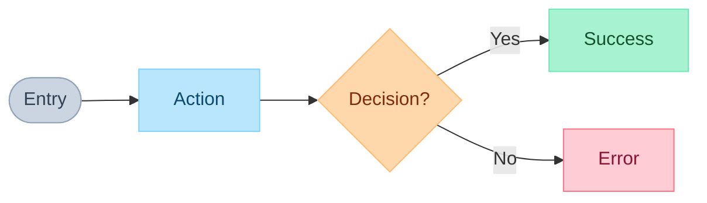

# PRD Skill

Create complete Product Requirements Documents through exhaustive questioning. User stories are built with UX detail - each answer becomes an acceptance criterion.

**Key Principle:** Ask questions, capture answers, answers become acceptance criteria. Never assume.

---

## Step 1: Detect Platform & Verify Connection

**Auto-detect platform from user input:**
- Notion URL → use Notion
- User mentions "Notion" → use Notion
- Anytype URL or object ID → use Anytype
- User mentions "Anytype" → use Anytype
- Otherwise → ask at save time (Step 7)

**Only verify the detected platform:**

### If Notion detected:
1. Run `notion-find` to search for "test"
2. **IF fails:** "Notion connection expired. Run `/mcp` to reconnect, then retry." → **STOP**
3. **IF succeeds:** proceed

### If Anytype detected:
1. Run `API-list-spaces` to verify connection
2. **IF fails:** "Anytype connection expired. Run `/mcp` to reconnect, then retry." → **STOP**
3. **IF succeeds:** proceed

---

## Step 2: Problem & Users (Quick Context)

Use `AskUserQuestion` to clarify:

1. **Problem** - "What problem does this solve? (1-2 sentences)"
2. **Users** - "Who has this problem?"
3. **Scope** - "What are the main things users need to do?" (This seeds user stories)

Keep this fast - detailed work happens per user story.

---

## Step 3: Identify User Stories

From Step 2 scope answer, identify distinct user stories:

```
Based on your scope, I see these user stories:
- US-001: [Goal 1]
- US-002: [Goal 2]
- US-003: [Goal 3]

Does this capture everything? Any to add/remove?
```

Get user confirmation before proceeding.

---

## Step 4: Build Each User Story (Invoke UX Skill)

**For EACH user story, invoke the UX skill for exhaustive questioning.**

### 4.1 Announce the User Story
```
Building US-XXX: [Title]
As a [user], I want [goal]...
```

### 4.2 Invoke UX Skill

**>>> USE THE `ux` SKILL NOW <<<**

Pass to UX skill:
- User Story statement
- Any context already known

The UX skill will:
1. Ask exhaustive questions (8 categories)
2. Cross-check edge cases
3. Resolve UX trade-offs
4. Return structured acceptance criteria

**Wait for UX skill to return before proceeding.**

### 4.3 Create Flow Diagram

After UX skill returns, create FigJam diagram for the user story:

Use `mcp__plugin_figma_figma__generate_diagram` with:
- `name`: "US-XXX: [Title] Flow"
- `mermaidSyntax`: Flowchart LR direction, all text in quotes
- `userIntent`: User story goal

**Max 15 nodes. Rules:**


### 4.4 Compile User Story

**>>> READ `references/output-templates.md` NOW <<<**

Use the "Enhanced User Story Template" from the templates file. Format:

```markdown
### US-XXX: [Title]

As a [user], I want [goal], so that [benefit].

**UX Expectation:**
[Answer from Category 1 - user's exact words]

**User Flow:**
[FigJam link from Step 4.6]

**Acceptance Criteria:**

Happy Path:
- [ ] [User's answer: step 1]
- [ ] [User's answer: step 2]
- [ ] [User's answer: success confirmation]

Validation:
- [ ] When [field] is [invalid], show "[user's error message]"

Errors:
- [ ] When API fails, [user's answer]
- [ ] When offline, [user's answer]

States:
- [ ] Loading: [user's answer]
- [ ] Empty: [user's answer]

Permissions:
- [ ] When unauthorized, [user's answer]

Accessibility:
- [ ] [user's answer: keyboard]
- [ ] [user's answer: mobile]

Edge Cases:
- [ ] [user's answer from UX skill questioning]
- [ ] [any gaps found from UX skill edge-case cross-check]
```

**>>> REPEAT Step 4 for EACH user story <<<**

---

## Step 5: Constraints & Success Criteria

After all user stories are built:

Use `AskUserQuestion`:
- "Any constraints? (Budget, timeline, compliance, tech stack)"
- "What's explicitly out of scope?"
- "How do we measure success? (Include specific numbers)"

---

## Step 6: Review Complete PRD

**>>> READ `references/output-templates.md` for "PRD Template" <<<**

Show the complete PRD to user:

```markdown
# [Feature Name]

## Problem
[From Step 2 - max 3 sentences]

## Users
[From Step 2]

## User Stories

[All compiled user stories from Step 4]

## Constraints
[From Step 5]

## Out of Scope
[From Step 5]

## Success Criteria
[From Step 5 - with numbers]
```

Ask: "Here's the complete PRD with X user stories and Y acceptance criteria. Ready to save?"

---

## Step 7: Save Document

**If platform was detected in Step 1:** use that platform directly.
**If no platform detected:** Ask "Where should I save this?" (Notion/Anytype)

### If Notion:
1. Ask for database name or page URL
2. Use `notion-find` to locate target
3. Create with Name = feature name, full PRD in body
4. If database has `Type` property, set to `["PRD"]`

### If Anytype:
1. Use `API-list-spaces` to show spaces
2. Ask which space
3. Use `API-create-object` with type_key "page", name = feature name, body = full PRD

---

## Step 8: Report

```
## PRD Complete

**Document:** [URL or object ID]
**Platform:** Notion/Anytype

### Summary
- User stories: X
- Total acceptance criteria: Y
- Flow diagrams: Z

### User Stories
| Story | ACs | Flow |
|-------|-----|------|
| US-001: [title] | X | [link] |
| US-002: [title] | Y | [link] |

### Next Steps
Run `/vorbit:implement:epic` to create Linear issues.
Each acceptance criterion becomes a testable requirement.
```

---

## Reference Files & Skills

| Resource | When to Use | Purpose |
|----------|-------------|---------|
| **`ux` skill** | Step 4.2 | Exhaustive UX questioning (has question matrix, edge cases, philosophy) |
| `references/output-templates.md` | Step 4.4, 6 | Exact format for PRD and user story outputs |

---

## Key Principle: User Answers = Acceptance Criteria

| Question | User Answer | Becomes |
|----------|-------------|---------|
| "What if email empty?" | "Show 'Email required'" | `- [ ] When email empty, show "Email required"` |
| "What during loading?" | "Spinner with text" | `- [ ] Loading: Show spinner with text` |
| "What if API fails?" | "Retry button, keep data" | `- [ ] When API fails, show retry, preserve data` |

**Never interpret.** Use user's exact words in acceptance criteria.