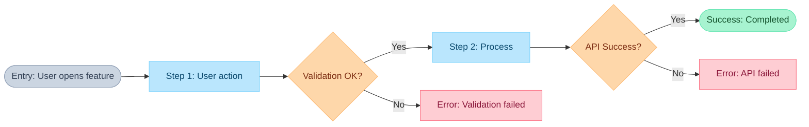

# PRD Output Templates

Copy-paste templates for generating PRD outputs.

---

## PRD Template

```markdown
# [Feature Name]

## Problem
[Max 3 sentences - user pain, not technical gap]

## Users
[Who has this problem]

## User Stories

[Insert Enhanced User Story Template for each story]

## Constraints
- [Budget, timeline, compliance, tech stack]

## Out of Scope
- [What we're NOT building]

## Success Criteria
- [Measurable metric with number]
- [Another measurable metric]
```

---

## Enhanced User Story Template

```markdown
### US-XXX: [User Story Title]

As a [user type], I want [goal], so that [benefit].

**UX Expectation:**
[User's description of the ideal experience - their exact words from Q&A]

**User Flow:**
[FigJam diagram link]

**Acceptance Criteria:**

Happy Path:
- [ ] [User's answer: first step]
- [ ] [User's answer: second step]
- [ ] [User's answer: success confirmation]

Validation:
- [ ] When [field] is empty, show "[user's error message]"
- [ ] When [field] format is invalid, show "[user's error message]"
- [ ] Validation occurs [user's answer: on blur/submit]

Errors:
- [ ] When API fails, [user's answer]
- [ ] When offline, [user's answer]
- [ ] When timeout, [user's answer]

States:
- [ ] Loading: [user's answer]
- [ ] Empty: [user's answer]

Permissions:
- [ ] When unauthorized, [user's answer]
- [ ] When session expires, [user's answer]

Accessibility:
- [ ] [user's answer: keyboard navigation]
- [ ] [user's answer: screen reader]
- [ ] [user's answer: mobile]

Edge Cases:
- [ ] [user's answer: multi-tab behavior]
- [ ] [user's answer: concurrent editing]
- [ ] [any gaps found from edge-case-catalog.md]
```

---

## Mermaid Flow Diagram Template



**Rules for FigJam diagrams:**
- Max 15 nodes total
- Use `LR` direction (left-to-right)
- Put ALL text in quotes
- Apply color classes to ALL nodes
- No emojis, no `\n` for newlines
- Error states are terminal (no back-loops)

---

## Report Template

```markdown
## PRD Complete

**Document:** [URL or object ID]
**Platform:** Notion/Anytype

### Summary
- User stories: X
- Total acceptance criteria: Y
- Flow diagrams: Z

### User Stories
| Story | ACs | Flow |
|-------|-----|------|
| US-001: [title] | X | [link] |
| US-002: [title] | Y | [link] |

### Next Steps
Run `/vorbit:implement:epic` to create Linear issues.
Each acceptance criterion becomes a testable requirement.
```

---

## Quick Reference: Question Categories

Use this checklist when questioning each user story:

```markdown
### Question Checklist: [User Story ID]

**1. UX Expectation & Happy Path**
- [ ] Ideal experience description?
- [ ] Step-by-step actions?
- [ ] Success confirmation?

**2. Validation**
- [ ] All field validations?
- [ ] Error messages?
- [ ] Timing (blur/submit)?

**3. System & Network Errors**
- [ ] API failure handling?
- [ ] Offline handling?
- [ ] Timeout handling?
- [ ] Retry behavior?

**4. Loading & Empty States**
- [ ] Loading indicator type?
- [ ] First-time user state?
- [ ] No data state?

**5. Permissions**
- [ ] Unauthorized access?
- [ ] Session expiry?
- [ ] Role differences?

**6. Device & Accessibility**
- [ ] Mobile behavior?
- [ ] Keyboard navigation?
- [ ] Screen reader?

**7. Concurrent & Time**
- [ ] Multi-tab behavior?
- [ ] Multi-user conflicts?
- [ ] Timezone handling?

**8. Recovery**
- [ ] Undo capability?
- [ ] Draft saving?
- [ ] Exit warning?
```

---

## Acceptance Criteria Categories

When compiling user story, group ACs by category:

| Category | Examples |
|----------|----------|
| **Happy Path** | Success flow steps, confirmation message |
| **Validation** | Empty field, invalid format, too long/short |
| **Errors** | API failure, offline, timeout, server error |
| **States** | Loading, empty, partial, stale data |
| **Permissions** | Unauthorized, session expired, role-specific |
| **Accessibility** | Keyboard nav, screen reader, touch targets |
| **Edge Cases** | Multi-tab, concurrent edit, deep links |
