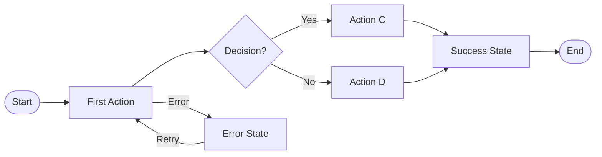

# Mermaid Diagram Patterns

## Step Types

| Type | Mermaid Shape | Use Case |
|------|---------------|----------|
| `start` | `([text])` | User's starting point |
| `action` | `[text]` | User performs action |
| `decision` | `{text?}` | User/system makes choice |
| `success` | `[text]` | Positive outcome |
| `error` | `[text]` | Error state |
| `end` | `([text])` | User leaves flow |

## Base Template



## Direction Options

- `LR` - Left to Right (default, recommended)
- `TD` - Top Down (for vertical flows)

## Styling


## Subgraphs for Complex Flows


## Edge Labels

Always label decision branches:
```mermaid
B{Valid?} -->|Yes| C
B -->|No| D
```

Never use unlabeled branches from decisions.

## Max Complexity

| Flow Size | Steps | Recommendation |
|-----------|-------|----------------|
| Simple | 1-5 | Single diagram |
| Medium | 6-10 | Single diagram with sections |
| Complex | 11-15 | Consider subgraphs |
| Too Large | 16+ | MUST split into sub-flows |
