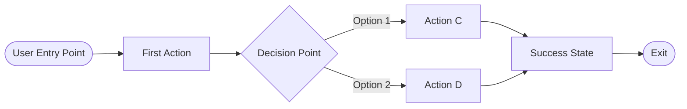

# User Flow: [FEATURE_NAME]

**Created**: [DATE] | **Source PRD**: [PRD_FILE]
**Notion URL**: [NOTION_URL]

---

## User Journey Overview

[Brief description of the main user journey this flow covers]

## Flow Diagram

## Flow Steps

### Step 1: [Entry Point]
- **Trigger**: [What brings user here]
- **User Goal**: [What user wants to achieve]
- **UI State**: [What user sees]

### Step 2: [Main Action]
- **User Input**: [What user does]
- **System Response**: [What system does]
- **Next**: [Where flow goes]

### Step 3: [Decision Point]
- **Condition**: [What determines path]
- **Path A**: [One option]
- **Path B**: [Other option]

### Step 4: [Success State]
- **Outcome**: [What user achieved]
- **Feedback**: [How system confirms success]
- **Exit Options**: [What user can do next]

---

## Edge Cases

| Scenario | User State | System Response |
|----------|------------|-----------------|
| [Error case 1] | [User context] | [How we handle] |
| [Error case 2] | [User context] | [How we handle] |

## User Story Mapping

| Flow Step | Maps to User Story |
|-----------|-------------------|
| Step 1 | US-001 |
| Step 2 | US-002 |
| Step 3 | US-003 |

---

## Review Checklist
- [ ] Flow covers main user journey from PRD
- [ ] All decision points have clear conditions
- [ ] Error states are handled
- [ ] Synced to Notion for team review