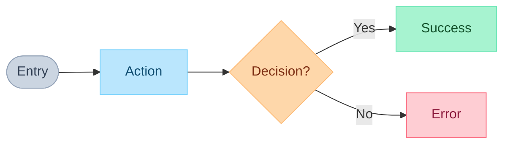

# UX Clarification Skill

Exhaustive UX questioning to transform vague requirements into precise, testable acceptance criteria.

**Core Principle:** Ask questions → User answers → Answers become acceptance criteria (verbatim).

---

## When to Use This Skill

| Calling Skill | Trigger |
|---------------|---------|
| **PRD** | Building each user story |
| **Epic** | No PRD exists, need to gather requirements |
| **Implement** | Requirements unclear, edge cases undefined |

---

## Input

Receive from calling skill:
- **User Story** or **Task Description**
- **Context** (what's already known)

---

## Process: Exhaustive Q&A

### Step 1: Load Question Matrix

**>>> READ `references/question-matrix.md` NOW <<<**

This file contains 14 question categories. Use ALL relevant categories.

### Step 2: Question by Category

Use `AskUserQuestion` with 2-4 questions per batch. Go through each category:

| Category | Questions From | Output |
|----------|----------------|--------|
| 1. Entry & Happy Path | Matrix sections 1-2 | UX Expectation + Happy Path ACs |
| 2. Validation | Matrix section 3 | Validation ACs |
| 3. System Errors | Matrix section 4 | Error ACs |
| 4. Permissions | Matrix section 5 | Permission ACs |
| 5. Loading & Empty | Matrix sections 6-7 | State ACs |
| 6. Concurrent & Time | Matrix sections 8-9 | Edge Case ACs |
| 7. Device & Accessibility | Matrix sections 10-11 | Accessibility ACs |
| 8. Recovery & Notifications | Matrix sections 12-13 | Recovery ACs |

**Skip categories not relevant to the task.**

### Step 3: Cross-Check Edge Cases

**>>> READ `references/edge-case-catalog.md` NOW <<<**

After user answers:
1. Compare answers against catalog entries
2. Identify common edge cases NOT covered
3. Ask follow-up: "What should happen when [scenario]?"

### Step 4: Resolve Uncertainty

**>>> READ `references/ux-philosophy.md` WHEN USER IS UNSURE <<<**

If user says "I don't know" or "whatever you think":
1. Read philosophy file for decision frameworks
2. Present options with trade-offs
3. User's choice becomes the AC

---

## Output Format

Return structured UX content to calling skill:

```markdown
## UX Clarification: [Task/Story Title]

### UX Expectation
[User's description of ideal experience - their exact words]

### User Flow
[Generate FigJam diagram if complex, or describe flow]

### Acceptance Criteria

**Happy Path:**
- [ ] [User's answer: step 1]
- [ ] [User's answer: step 2]
- [ ] [User's answer: success confirmation]

**Validation:**
- [ ] When [field] is [invalid], show "[user's error message]"

**Errors:**
- [ ] When API fails, [user's answer]
- [ ] When offline, [user's answer]

**States:**
- [ ] Loading: [user's answer]
- [ ] Empty: [user's answer]

**Permissions:**
- [ ] When unauthorized, [user's answer]

**Accessibility:**
- [ ] [user's keyboard answer]
- [ ] [user's mobile answer]

**Edge Cases:**
- [ ] [user's answer from concurrent/time questions]
- [ ] [gaps found from edge-case-catalog.md]
```

---

## Flow Diagram Generation

For complex flows, use `mcp__plugin_figma_figma__generate_diagram`:



**Rules:** Max 15 nodes, LR direction, all text in quotes, no emojis.

---

## Key Principle: Verbatim Answers

| Question | User Answer | Becomes |
|----------|-------------|---------|
| "What if email empty?" | "Show 'Email required'" | `- [ ] When email empty, show "Email required"` |
| "What during loading?" | "Spinner with text" | `- [ ] Loading: Show spinner with text` |
| "What if API fails?" | "Retry button, keep data" | `- [ ] When API fails, show retry, preserve data` |

**Never interpret.** Use user's exact words.

---

## Quick Mode

For simple tasks (< 3 acceptance criteria needed):
- Ask only relevant categories
- Skip edge case catalog
- Return minimal output

---

## Reference Files

| File | When to Read | Purpose |
|------|--------------|---------|
| `references/question-matrix.md` | Step 1 | All questions by category |
| `references/edge-case-catalog.md` | Step 3 | Cross-check for gaps |
| `references/ux-philosophy.md` | Step 4 | Decision frameworks when user unsure |
